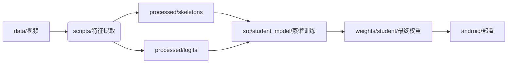

# Lightweight-SRT
基于大小模型协同的轻量级手语识别模型

## 项目简介
本项目旨在开发一个高效、轻量级的手语识别系统。核心思路是利用高性能的 **I3D (Inflated 3D ConvNet)** 模型作为教师模型，通过 **知识蒸馏 (Knowledge Distillation)** 技术，将知识迁移到基于骨骼点的轻量级 **ST-GCN (Spatial Temporal Graph Convolutional Network)** 学生模型中。最终实现能够在移动端（Android）实时运行的高精度手语识别。

---

## 项目架构重构说明 (2026-04-02)

为了提高代码的可维护性、扁平化目录结构并实现职责分离，本项目进行了一次重大的架构重构。

### 主要变更点：
1.  **目录扁平化**：移除了深层嵌套的 `I3D/I3D_WLASL/code` 和 `third_party/st-gcn`，将核心代码整合至根目录下的 `src/`。
2.  **职责分离**：
    *   `src/common/`: 存放通用的 `datasets` 和 `transforms`。
    *   `src/teacher_model/`: 整合教师模型 (I3D) 的定义、训练与测试。
    *   `src/student_model/`: 整合学生模型 (ST-GCN) 的定义、蒸馏逻辑与训练。
3.  **配置集中化**：所有配置文件（`.ini`, `.yaml`）统一存放在 `configs/` 下。
4.  **数据流隔离**：
    *   `data/`: 原始 WLASL 数据集。
    *   `processed/`: 存放预处理后的中间特征（骨骼点 `skeletons` 和教师 `logits`）。
5.  **脚本工具化**：将独立运行的预处理和特征提取脚本移至 `scripts/`。
6.  **移动端重命名**：`SRTApp` 重命名为 `android/`，符合多端开发习惯。

---

## 核心架构介绍

### 1. 模型核心 (`src/*/architecture/`)
- **教师模型 (I3D)**: 位于 `src/teacher_model/architecture/pytorch_i3d.py`，基于 PyTorch 实现了经典的 Inception-I3D 结构。
- **学生模型 (ST-GCN)**: 位于 `src/student_model/architecture/st_gcn.py`，轻量化的时空图卷积网络。

### 2. 数据处理流水线 (`src/common/`)
- **多模态支持**: `src/common/datasets/nslt_dataset.py` 支持 RGB 视频帧和光流数据的加载。
- **数据增强**: `src/common/transforms/videotransforms.py` 实现了针对视频序列的空间变换。

### 3. 知识蒸馏 (`src/student_model/distillation/`)
- **蒸馏逻辑**: `src/student_model/distillation/recognition_kd.py` 实现了教师模型对学生模型的知识转移。
- **特征提取**: `scripts/feature_extraction/extract_teacher_logits.py` 用于提取高性能教师模型的预测结果，保存至 `processed/logits/`。

### 4. 预处理与工具 (`scripts/`)
- **骨架提取**: `scripts/feature_extraction/extract_skeleton.py` 使用 MediaPipe 提取手部关键点。
- **数据校验**: `scripts/data_prep/check_id_alignment.py` 用于确保数据集 ID 与特征的对齐。

### 5. 项目结构图
```text
Lightweight-SRT/
├── android/            # Android 移动端工程
├── configs/            # 训练与模型配置 (teacher/student)
├── data/               # 原始数据集与预处理 JSON
├── processed/          # 提取后的骨骼点与 Logits (不进入 Git)
├── scripts/            # 数据准备与特征提取脚本
├── src/                # 核心源代码
│   ├── common/         # 公共数据处理模块
│   ├── teacher_model/  # 教师模型相关逻辑
│   └── student_model/  # 学生模型相关逻辑
└── weights/            # 模型权重文件
```



---

## 快速上手指南

### 1. 环境配置
建议使用 Python 3.8+ 环境，安装以下核心依赖：
```bash
pip install torch torchvision numpy opencv-python mediapipe pyyaml matplotlib
```

### 2. 数据准备与对齐
在开始训练前，需确保骨骼点和教师 Logits 已提取并对齐：
```bash
# 检查数据对齐情况
python scripts/data_prep/check_id_alignment.py

# 过滤低质量样本并生成训练索引
python scripts/data_prep/build_dataset_json.py

# 抽查教师 Logits 正确性
python scripts/data_prep/verify_logits.py
```

### 3. 启动知识蒸馏训练 (核心)
运行以下命令启动学生模型的蒸馏训练：
```bash
python src/student_model/distillation/recognition_kd.py --config configs/student/st_gcn/wlasl2000/train_kd.yaml
```
*训练日志和权重将保存在 `./work_dir/` 目录下。*

### 4. 可视化演示
如果你想直观地查看数据流、骨骼点可视化以及模型前向传播闭环，可以运行：
```bash
# 启动 Jupyter 查看演示笔记本
jupyter notebook demo/demo_pipeline.ipynb
```

---

## 核心资产说明
- **数据集**: 使用 WLASL2000 (Word-Level American Sign Language)。
- **特征数据**: 存放于 `processed/`，包含 21 个手部关键点序列和 I3D 提取的 2000 维 Logits。
通过网盘分享的文件：数据集
  链接: https://pan.baidu.com/s/1C0Y-Zry6FIuBv30o6ESLJA?pwd=gp6i 提取码: gp6i
- **移动端**: 位于 `android/`，是基于 Kotlin 开发的实时识别 App。
