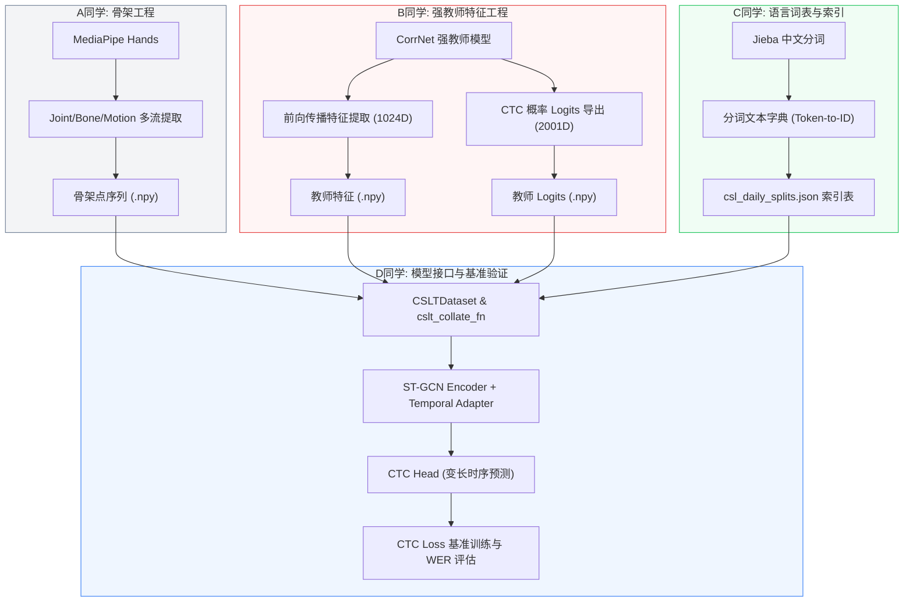

# 组会进展报告：轻量化手语识别与翻译系统的自蒸馏及连续性演进
# Progress Report on Lightweight Sign Language Recognition and Translation: Self-Distillation and Continuous Paradigm Transition

**报告时间**：2026年5月29日  
**项目名称**：Lightweight-SRT (轻量化手语识别与翻译)  
**汇报人**：项目联合工作组  

---

## 1. 引言 (Introduction)

手语识别与翻译系统对打破听障群体与健听群体之间的沟通壁垒具有深远的社会价值。为了将复杂且庞大的手语视频翻译成自然语言句子，项目组探索了以轻量化骨架点模型为载体、强教师模型为引导的知识蒸馏方案。随着第一阶段孤立词识别任务的成功收敛，项目目前正在快速向多模态连续手语翻译（Continuous Sign Language Translation, CSLT）任务演进。本报告旨在回顾孤立词阶段的技术创新与顶峰性能，展示模型架构的可视化成果，并详细梳理当前在 CSL-Daily 数据集上的最新开发管线进度。

---

## 2. 词级孤立词任务 (WLASL2000) 训练回顾与 SOTA 结果 (Review of WLASL2000 Tasks)

在项目的第一阶段，我们聚焦于 WLASL2000 大规模孤立词数据集的轻量化骨架手语识别。针对训练中期遇到的瓶颈，项目组通过定位索引偏差和重构蒸馏策略，实现了准确率的跨越式突破。

### 2.1 挑战诊断与弱教师瓶颈 (Diagnostic and Bottleneck Analysis)
早期蒸馏实验（采用 Hint Loss 与 Logits 蒸馏）在 **33% - 34%** 的 Top-1 准确率处遭遇严重瓶颈。经深度诊断，项目组发现了两个关键设计漏洞：
- **弱教师锚定效应**：所采用的视频教师模型（I3D）在 WLASL2000 数据集上的 Top-1 准确率仅为 **33.0%**。由于蒸馏比重过大，强行对齐弱教师的输出导致学生模型受到了教师性能的上限锚定。
- **标签索引偏差与坐标畸变**：由于加载的标签映射文件（`label_map.json`）产生错位，导致学生模型与教师模型的输出 Logits 类别索引产生偏差，产生了互相冲突的梯度流。此外，对手部骨架点进行的过度手腕归一化去除了空间绝对位移，导致绝对运动幅度信息丢失。

### 2.2 关键技术方案 (`aligned_v2` 与 `v4-Refine`)
为克服上述漏洞，项目组先后实施了两次技术迭代：
1. **`aligned_v2` 对齐对策**：
   - **标签对齐**：强制数据集读取 `nslt_2000.json` 标准索引，实现学生模型与教师模型 Logits 级别的 100% 梯度对齐。
   - **绝对坐标保留**：设置 `normalize_wrist: false`，取消手腕位置归一化，保留手部节点在空间中的绝对空间运动轨迹，以匹配教师模型的全局视觉感知。
   - **标准三流架构**：回归 Joint（关节坐标）、Bone（骨骼向量）与 Motion（相邻帧位移）的标准三流 ST-GCN 分类架构。
   - **效果**：仅依赖 Logits 蒸馏，三流学生模型便一举超越教师模型，Top-1 准确率跃升至 **37.13%**（Top-5 达 **69.26%**）。

2. **`v4-Refine` 精英权重二次提纯**：
   - **弱约束特征正则化**：加载前期最优的 **37.13%** 预训练权重作为初始化状态，将蒸馏损失的干预权重下调至极低水平（`kd_alpha=0.05`, `hint_weight=0.02`）。此时蒸馏退化为特征正则项，规避了弱教师模型的直接限制。
   - **微学习率精修**：在 Batch Size=64 条件下，使用 0.001 的极低初始学习率与温度系数 $T=5.0$ 进行长周期平滑精修。
   - **效果**：ST-GCN 学生模型取得了 **38.28%** 的 Top-1 准确率和 **71.17%** 的 Top-5 准确率。该结果大幅反超了 33.0% 的教师模型，创下了项目当前 SOTA 纪录。

### 2.3 性能演进与蒸馏提纯对比图 (Performance Comparison)
为了直观展现不同优化策略对模型准确率的提升，项目组总结了从教师模型到学生模型各迭代阶段的 Top-1 及 Top-5 准确率指标。

**图 4 | 知识蒸馏框架在 WLASL2000 孤立词任务上的精度演进对比图。** 展示了视频强教师（I3D）与轻量化 ST-GCN 学生模型各迭代阶段（原始 Baseline、`aligned_v2` 全局与标签对齐版、`v4-Refine` 二次提纯版）的性能跨越，验证了二次提纯策略突破“弱教师锚定效应”的优越性。

---

## 3. 多模态骨干模型与自蒸馏机制的可视化表示 (Visual Representation of Architectures)

为提供期刊级的学术可视化表征，项目组使用自研 Matplotlib 脚本绘制了本研究涉及的三大核心模型架构图，已全部导出至根目录下 `visualizations/` 文件夹中。

### 3.1 I3D 视频教师模型架构 (Video Teacher Model)
I3D 作为手语原始视频的视觉特征提取器，其主要负责将三维的连续视频帧映射为高维的时空表征。

**图 1 | 3D 膨胀卷积神经网络 (I3D) 教师模型架构表征。** 
- **Panel a | 骨干网络级联流**：展示从 $T \times H \times W \times C$ 视频输入开始，通过 3D 卷积/最大池化 Stem 模块，串联 Mixed 3b 至 Mixed 5c 的 3D Inception 模块，最终映射为 1024 维的高维特征。
- **Panel b | Inception-3D 模块拆解**：详解 4 个并行分支的卷积结构。分支 1 包含单个 $1 \times 1 \times 1$ 卷积；分支 2 与 3 通过 $1 \times 1 \times 1$ 降维后再经过 $3 \times 3 \times 3$ 时空卷积；分支 4 包含 3D 最大池化与通道调整级。
- **Panel c | 多感受野时空拼接**：通过时空池化与全连接层输出最终的词汇预测 Logits，展示了各个尺度特征在通道维度拼接的融合过程。

### 3.2 ST-GCN 轻量化学生模型架构 (Spatio-Temporal Graph Student Model)
ST-GCN 通过构建时空图拓扑结构，直接在人体骨架点序列上执行图卷积，大幅削减了参数量。

**图 2 | 时空图卷积神经网络 (ST-GCN) 学生模型架构表征。** 
- **Panel a | 时空骨干流水线**：由 10 层 st_gcn 块级联组成，通道数依次为 64-128-256，利用时序卷积进行下采样，尾部连接 FCN 头部进行词级别预测。
- **Panel b | st_gcn 单元拓扑激活**：详解单元内部的数据流向。输入先流经 Spatial GCN 学习帧内空间骨骼结构，随后进入 Temporal TCN 学习帧间时序动态，侧边结合残差连接进行残差求和。
- **Panel c | 时空图拓扑机制**：展示了手部和身体骨架的节点（Joints）、帧内连接（Bones）以及相邻帧相同节点的时序边（Temporal Edges）的拓扑表征。

### 3.3 CorrNet 连续手语教师模型架构 (CorrNet Continuous Teacher Model)
CorrNet 是针对连续手语翻译（CSLT）任务的强教师模型，通过自监督相互蒸馏（SMKD）解决了长手语序列特征提取的难题。

**图 3 | 连续手语 CorrNet 教师模型及相互监督蒸馏机制。** 
- **Panel a | 时序融合特征提取**：原始图像输入至 3D ResNet18（嵌入用于时空关联融合的 CorrBlock 模块），通过 1D 时序卷积降采样，最后在 2-Layer BiLSTM 序列层中进行编码。
- **Panel b | CorrBlock 关联模块机制**：展示 Get_Correlation 组件如何计算时序帧之间的亲和矩阵（Affinity），并通过多尺度空间聚合（Multi-scale Spatial Aggregation）机制对特征图执行自适应调制。
- **Panel c | 自监督相互蒸馏 (SMKD) 损失约束**：表征了序列 CTC 损失 $\mathcal{L}_{SeqCTC}$、卷积 CTC 损失 $\mathcal{L}_{ConvCTC}$ 与自监督序列对齐损失 $\mathcal{L}_{SeqKD}$ 共同构成的损失回传和知识交互机制。

---

## 4. 连续手语翻译阶段 (CSLT) 进展与开发管线进度 (CSLT Progress)

随着词级识别任务完成收敛，项目目前正在全面向连续手语视频到自然语言句子的翻译系统（CSLT）演进。我们在 CSL-Daily 数据集上已构建了完整的 V0 - V3 级演进管线，当前处于 **W1 (数据与词表准备)** 向 **W2 (CSLR 基准验证)** 跨越的关键阶段。

### 4.1 数据工程与特征提取进度 (Task A & Task B)
- **多流骨骼特征提取**：A同学完成了基于 MediaPipe Hands 提取 CSL-Daily 手部关键点的提取。生成了包含 Joint、Bone、Motion 模态的多流序列，已存储在 `processed/` 对应模态路径下。
- **强教师特征与 Logits 导出**：B同学成功部署了 CorrNet 的环境，并加载了在 CSL-Daily 预训练的 `smkd_csl_daily_real.pt` 权重。通过运行前向传播脚本，批量导出了 1024D 的高维视觉语义特征和 2001D 的时序分类 Logits。目前在 `processed/csl_daily/teacher_features/` 和 `processed/csl_daily/teacher_logits/` 目录下已成功写入批量 `.npy` 文件。
- **时序对齐率校验**：经首批数据校验，骨骼点帧数与强教师特征步长完全匹配，符合 $T_{skeleton} = T_{teacher} \times 4$ 的时序降采样关系。

### 4.2 语言系统与数据索引进度 (Task C & Task D)
- **文本词表与 Tokenizer**：C同学利用 `jieba` 分词工具对 CSL-Daily 的标注中文句子执行了清洗与分词，建立了包含特殊的开始符 `<BOS>`、结束符 `<EOS>` 以及填充符 `<PAD>` 的文本映射字典。
- **多模态对齐索引映射**：已初步生成包含骨骼路径、教师特征路径、教师 Logits 路径、Gloss 标注和对应中文文本的 `csl_daily_splits.json` 文件。
- **连续数据集接口重构**：D同学设计了 CSL-Daily 专用的 `CSLTDataset` 与变长序列的 `cslt_collate_fn`。不仅能动态加载多模态骨架序列，还可以提供对齐的教师端蒸馏目标，从而有效消除了长时序的变长填充误差。

### 4.3 CSLT 协作数据流管线可视化 (Data Pipeline & Team Collaboration Flow)
为了清晰展现项目组 A-D 同学在连续手语识别与翻译第一阶段中的数据流转及协作关系，特构建如下数据流协作管线图：

---

## 5. 团队分工与下一步计划 (Labor Division & Milestones)

为了保证 CSL-Daily 连续识别与翻译管线的稳步落地，团队制定了如下下一步里程碑规划：

- **A同学 (数据管线与质量控制)**：负责解决视频中双人交互和遮挡导致的关键点丢失问题，进行骨架特征的时序插值和零填充。
- **B同学 (模型结构与重构)**：重构 ST-GCN Encoder 使其支持 `return_sequence=True` 提取变长特征流，编写对接 Transformer Decoder 的连接层（Temporal Adapter）。
- **C同学 (知识迁移与微调)**：加载 WLASL2000 上获得的 **38.28%** 的三流 ST-GCN 预训练权重作为时空特征编码器的底座，利用 CTC Loss 开始在 CSL-Daily 上进行初步的连续手语识别（CSLR）训练。
- **D同学 (指标评测与部署准备)**：编写 Beam Search/Greedy Search 文本解码器，接入 BLEU 和 ROUGE 指标计算管线，为后续的翻译网络联合蒸馏提供准确率评估。
